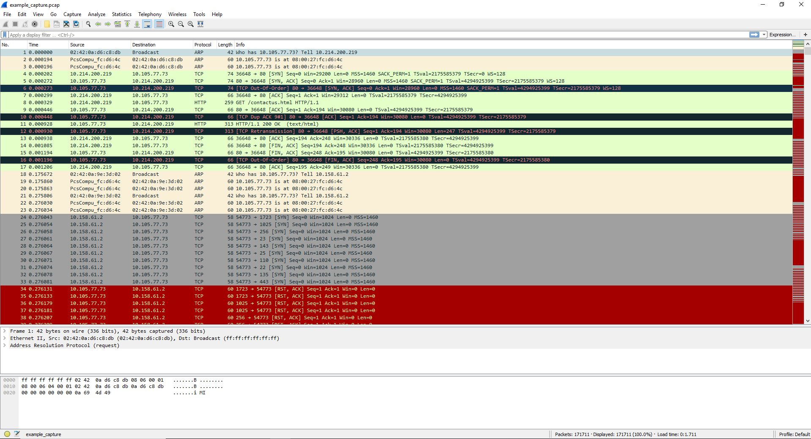

# Forensic-Scenario-Builder

Automatically stand up a private network that spawns predefined containers/vms and run through a pre-defined scenario. Once the scenario is finished the builder will create and return the requested forensic artifacts. An example scenario built could be defining a victim web server, a bunch of traffic creation bots that make requests to the web server, and an attacker that hacks into the web server. After the attack is done the web server logs are pulled off of the victim vm and a pcap of the traffic from the scenario is created.

## Usage
Usage:
```
$ ./scenario_builder.py --help
usage: scenario_builder.py [-h] --bot BOT [--bot-num BOT_NUM] --attacker
                           ATTACKER [--attacker-ip ATTACKER_IP] --victim
                           VICTIM [--victim-ip VICTIM_IP]
                           [--time-out TIME_OUT] [--logs [LOGS]]
                           [--disk-image [DISK_IMAGE]]
                           [--memory-dump [MEMORY_DUMP]] [--pcap [PCAP]]
                           [--subnet SUBNET]

Forensic Scenario Builder CLI

optional arguments:
  -h, --help            show this help message and exit
  --bot BOT             Location of file describing bot container or vm.
  --bot-num BOT_NUM     Number of bot containers to spawn. Defaults to one.
  --attacker ATTACKER   Location of file describing attacker container or vm.
  --attacker-ip ATTACKER_IP
                        Assign static ip to attacker. Defaults to random
                        assignment.
  --victim VICTIM       Location of file describing victim container or vm.
  --victim-ip VICTIM_IP
                        Assign static ip to victim. Defaults to random
                        assignment.
  --time-out TIME_OUT   Number of minutes to run scenario. Defaults to 5
                        minutes.
  --logs [LOGS]         Location to pull log file(s) from on victim after
                        scenario is done. Defaults to /var/log.
  --disk-image [DISK_IMAGE]
                        Create disk image of victim after scenario is done
  --memory-dump [MEMORY_DUMP]
                        Create memory dump of victim after scenario is done
  --pcap [PCAP]         Create packet capture of scenario traffic
  --subnet SUBNET       Subnet to place scenarios and containers on. Defaults
                        to 10.0.0.0/8
```

## Sample Outputs
Below are some sample outputs created from the example scenario included. The full outputs can be found in the `example` folder.
### /var/log/apache2/access.log
```
10.7.78.186 - - [18/May/2018:19:18:45 +0000] "GET /blog.html HTTP/1.1" 200 246 "-" "Mozilla/5.0 (Windows NT 6.1; WOW64; Trident/7.0; rv:11.0) like Gecko"
10.238.190.33 - - [18/May/2018:19:18:45 +0000] "GET /events.html HTTP/1.1" 200 243 "-" "Mozilla/5.0 (Macintosh; Intel Mac OS X 10_13_4) AppleWebKit/537.36 (KHTML, like Gecko) Chrome/65.0.3325.181 Safari/537.36"
10.246.37.52 - - [18/May/2018:19:18:46 +0000] "GET /contactus.html HTTP/1.1" 200 247 "-" "Mozilla/5.0 (Linux; Android 6.0; vivo 1713 Build/MRA58K) AppleWebKit/537.36 (KHTML, like Gecko) Chrome/53.0.2785.124 Mobile Safari/537.36"
10.59.153.108 - - [18/May/2018:19:18:48 +0000] "GET /blog.html HTTP/1.1" 200 246 "-" "Mozilla/5.0 (Windows NT 10.0; Win64; x64) AppleWebKit/537.36 (KHTML, like Gecko) Chrome/65.0.3325.181 Safari/537.36"
10.159.208.95 - - [18/May/2018:19:18:51 +0000] "GET /events.html HTTP/1.1" 200 243 "-" "Mozilla/5.0 (Windows NT 10.0; Win64; x64) AppleWebKit/537.36 (KHTML, like Gecko) Chrome/65.0.3325.181 Safari/537.36"
10.42.141.218 - - [18/May/2018:19:18:51 +0000] "GET /contactus.html HTTP/1.1" 200 247 "-" "Mozilla/5.0 (Windows NT 5.1; Win64; x64) AppleWebKit/537.36 (KHTML, like Gecko) Chrome/46.0.2486.0 Safari/537.36 Edge/13.10586"
10.125.54.101 - - [18/May/2018:19:18:52 +0000] "GET /login.html HTTP/1.1" 200 241 "-" "Mozilla/5.0 (iPhone; CPU iPhone OS 9_1 like Mac OS X) AppleWebKit/601.1.46 (KHTML, like Gecko) Version/9.0 Mobile/13B143 Safari/601.1"
10.7.78.186 - - [18/May/2018:19:18:54 +0000] "GET /index.html HTTP/1.1" 200 926 "-" "Mozilla/5.0 (Windows NT 6.1; WOW64; Trident/7.0; rv:11.0) like Gecko"
10.214.200.219 - - [18/May/2018:19:18:54 +0000] "GET /news.html HTTP/1.1" 200 240 "-" "Mozilla/5.0 (Windows NT 6.1; Win64; x64) AppleWebKit/537.36 (KHTML, like Gecko) Chrome/65.0.3325.181 Safari/537.36"
10.252.13.208 - - [18/May/2018:19:18:57 +0000] "GET /news.html HTTP/1.1" 200 240 "-" "Mozilla/5.0 (iPhone; CPU iPhone OS 9_1 like Mac OS X) AppleWebKit/601.1.46 (KHTML, like Gecko) Version/9.0 Mobile/13B143 Safari/601.1"
10.159.208.95 - - [18/May/2018:19:18:57 +0000] "GET /news.html HTTP/1.1" 200 240 "-" "Mozilla/5.0 (Windows NT 10.0; Win64; x64) AppleWebKit/537.36 (KHTML, like Gecko) Chrome/65.0.3325.181 Safari/537.36"
10.246.37.52 - - [18/May/2018:19:18:57 +0000] "GET /events.html HTTP/1.1" 200 243 "-" "Mozilla/5.0 (Linux; Android 6.0; vivo 1713 Build/MRA58K) AppleWebKit/537.36 (KHTML, like Gecko) Chrome/53.0.2785.124 Mobile Safari/537.36"
10.238.190.33 - - [18/May/2018:19:18:57 +0000] "GET /events.html HTTP/1.1" 200 243 "-" "Mozilla/5.0 (Macintosh; Intel Mac OS X 10_13_4) AppleWebKit/537.36 (KHTML, like Gecko) Chrome/65.0.3325.181 Safari/537.36"
10.252.13.208 - - [18/May/2018:19:18:58 +0000] "GET /index.html HTTP/1.1" 200 926 "-" "Mozilla/5.0 (iPhone; CPU iPhone OS 9_1 like Mac OS X) AppleWebKit/601.1.46 (KHTML, like Gecko) Version/9.0 Mobile/13B143 Safari/601.1"
10.252.13.208 - - [18/May/2018:19:18:58 +0000] "GET /contactus.html HTTP/1.1" 200 247 "-" "Mozilla/5.0 (iPhone; CPU iPhone OS 9_1 like Mac OS X) AppleWebKit/601.1.46 (KHTML, like Gecko) Version/9.0 Mobile/13B143 Safari/601.1"
10.238.252.26 - - [18/May/2018:19:18:58 +0000] "GET /events.html HTTP/1.1" 200 243 "-" "Mozilla/5.0 (Macintosh; Intel Mac OS X 10_13_4) AppleWebKit/537.36 (KHTML, like Gecko) Chrome/65.0.3325.181 Safari/537.36"
10.125.54.101 - - [18/May/2018:19:18:58 +0000] "GET /index.html HTTP/1.1" 200 926 "-" "Mozilla/5.0 (iPhone; CPU iPhone OS 9_1 like Mac OS X) AppleWebKit/601.1.46 (KHTML, like Gecko) Version/9.0 Mobile/13B143 Safari/601.1"
10.238.252.26 - - [18/May/2018:19:18:59 +0000] "GET /blog.html HTTP/1.1" 200 246 "-" "Mozilla/5.0 (Macintosh; Intel Mac OS X 10_13_4) AppleWebKit/537.36 (KHTML, like Gecko) Chrome/65.0.3325.181 Safari/537.36"
10.59.153.108 - - [18/May/2018:19:19:00 +0000] "GET /events.html HTTP/1.1" 200 243 "-" "Mozilla/5.0 (Windows NT 10.0; Win64; x64) AppleWebKit/537.36 (KHTML, like Gecko) Chrome/65.0.3325.181 Safari/537.36"
10.214.200.219 - - [18/May/2018:19:19:01 +0000] "GET /news.html HTTP/1.1" 200 240 "-" "Mozilla/5.0 (Windows NT 6.1; Win64; x64) AppleWebKit/537.36 (KHTML, like Gecko) Chrome/65.0.3325.181 Safari/537.36"
10.238.252.26 - - [18/May/2018:19:19:03 +0000] "GET /contactus.html HTTP/1.1" 200 247 "-" "Mozilla/5.0 (Macintosh; Intel Mac OS X 10_13_4) AppleWebKit/537.36 (KHTML, like Gecko) Chrome/65.0.3325.181 Safari/537.36"
10.7.78.186 - - [18/May/2018:19:19:03 +0000] "GET /index.html HTTP/1.1" 200 926 "-" "Mozilla/5.0 (Windows NT 6.1; WOW64; Trident/7.0; rv:11.0) like Gecko"
10.158.61.2 - - [18/May/2018:19:19:03 +0000] "GET /randomfile1.html HTTP/1.1" 404 453 "-" "Mozilla/4.0 (compatible; MSIE 6.0; Windows NT 5.1)"
10.158.61.2 - - [18/May/2018:19:19:03 +0000] "GET /frand2.html HTTP/1.1" 404 448 "-" "Mozilla/4.0 (compatible; MSIE 6.0; Windows NT 5.1)"
10.158.61.2 - - [18/May/2018:19:19:03 +0000] "GET /randomfile1.php HTTP/1.1" 404 452 "-" "Mozilla/4.0 (compatible; MSIE 6.0; Windows NT 5.1)"
10.158.61.2 - - [18/May/2018:19:19:03 +0000] "GET /frand2.php HTTP/1.1" 404 447 "-" "Mozilla/4.0 (compatible; MSIE 6.0; Windows NT 5.1)"
10.158.61.2 - - [18/May/2018:19:19:03 +0000] "GET /!.html HTTP/1.1" 404 443 "-" "Mozilla/4.0 (compatible; MSIE 6.0; Windows NT 5.1)"
10.158.61.2 - - [18/May/2018:19:19:03 +0000] "GET /!.php HTTP/1.1" 404 442 "-" "Mozilla/4.0 (compatible; MSIE 6.0; Windows NT 5.1)"
10.158.61.2 - - [18/May/2018:19:19:03 +0000] "GET /!_archives.html HTTP/1.1" 404 452 "-" "Mozilla/4.0 (compatible; MSIE 6.0; Windows NT 5.1)"
10.158.61.2 - - [18/May/2018:19:19:03 +0000] "GET /!_archives.php HTTP/1.1" 404 451 "-" "Mozilla/4.0 (compatible; MSIE 6.0; Windows NT 5.1)"
10.158.61.2 - - [18/May/2018:19:19:03 +0000] "GET /!_images.html HTTP/1.1" 404 450 "-" "Mozilla/4.0 (compatible; MSIE 6.0; Windows NT 5.1)"
10.158.61.2 - - [18/May/2018:19:19:03 +0000] "GET /!_images.php HTTP/1.1" 404 449 "-" "Mozilla/4.0 (compatible; MSIE 6.0; Windows NT 5.1)"
10.158.61.2 - - [18/May/2018:19:19:03 +0000] "GET /!backup.html HTTP/1.1" 404 449 "-" "Mozilla/4.0 (compatible; MSIE 6.0; Windows NT 5.1)"
10.158.61.2 - - [18/May/2018:19:19:03 +0000] "GET /!backup.php HTTP/1.1" 404 448 "-" "Mozilla/4.0 (compatible; MSIE 6.0; Windows NT 5.1)"
10.158.61.2 - - [18/May/2018:19:19:03 +0000] "GET /!images.html HTTP/1.1" 404 449 "-" "Mozilla/4.0 (compatible; MSIE 6.0; Windows NT 5.1)"
10.158.61.2 - - [18/May/2018:19:19:03 +0000] "GET /!images.php HTTP/1.1" 404 448 "-" "Mozilla/4.0 (compatible; MSIE 6.0; Windows NT 5.1)"
10.158.61.2 - - [18/May/2018:19:19:03 +0000] "GET /!res.html HTTP/1.1" 404 446 "-" "Mozilla/4.0 (compatible; MSIE 6.0; Windows NT 5.1)"
10.158.61.2 - - [18/May/2018:19:19:03 +0000] "GET /!res.php HTTP/1.1" 404 445 "-" "Mozilla/4.0 (compatible; MSIE 6.0; Windows NT 5.1)"
10.158.61.2 - - [18/May/2018:19:19:03 +0000] "GET /!textove_diskuse.html HTTP/1.1" 404 458 "-" "Mozilla/4.0 (compatible; MSIE 6.0; Windows NT 5.1)"
10.158.61.2 - - [18/May/2018:19:19:03 +0000] "GET /!textove_diskuse.php HTTP/1.1" 404 457 "-" "Mozilla/4.0 (compatible; MSIE 6.0; Windows NT 5.1)"
10.158.61.2 - - [18/May/2018:19:19:03 +0000] "GET /!ut.html HTTP/1.1" 404 445 "-" "Mozilla/4.0 (compatible; MSIE 6.0; Windows NT 5.1)"
10.158.61.2 - - [18/May/2018:19:19:03 +0000] "GET /!ut.php HTTP/1.1" 404 444 "-" "Mozilla/4.0 (compatible; MSIE 6.0; Windows NT 5.1)"
10.158.61.2 - - [18/May/2018:19:19:03 +0000] "GET /.bash_history.html HTTP/1.1" 404 455 "-" "Mozilla/4.0 (compatible; MSIE 6.0; Windows NT 5.1)"
```

### capture.pcap


## Scenario Set up
### Victim
The Victim VM is the target of the attacker and the bots. This is the VM that all of the forensic data will be pulled from.  
Currently only Vagrant is supported for the victim vm. To create a victim vm create a folder containing the Vagrant template file and all supporting files. An example victim folder can be found under the `example` folder. Currently the builder looks for a `Vagrantfile-template` in the victim folder to generate a proper `Vagrantfile` to spin up the machine. In order to make the networking work with docker the `Vagrantfile-template` must include the following lines:
```
Vagrant.configure("2") do |config|
    config.vm.box = "<Box Name>"

    config.ssh.private_key_path = ["/tmp/vagrant_private.key", "~/.vagrant.d/insecure_private_key"]
    config.ssh.insert_key = false

    config.vm.network "public_network", ip: "{{ victim_ip }}", bridge: "{{ bridge }}"
    config.vm.provision "shell",
        run: "always",
        inline: "ifconfig enp0s8 {{ victim_ip }} netmask {{ netmask }} up"

    config.vm.provision "file", source: "/tmp/vagrant_public.key", destination: "~/.ssh/authorized_keys"
end
```

### Bot
The Bot containers are used to generate fake traffic to add a little bit of realism to the scenario.  
Currently only Docker is supported for the creation of bots. To create a bot create a folder containing a Dockerfile and all of the necessary supporting files. An example bot folder can be found under the `example` folder. This will be used to create and spin up the specificied amount of containtainers. The victim ip is passed into the container as an environment variable named `$VICTIM_IP` upon the building of the container.  

### Attacker
The Attacker container is used to run through the simulated attackers actions.  
Currently only Docker is supported for the creation of the Attacker container. To create the attacker create a folder containing a Dockerfile and all of the necessary supporting files. An example attacker folder can be found under the `example` folder. This will be used to create and spin up the attacker containtainer. The victim ip is passed into the container as an environment variable named `$VICTIM_IP` upon the buidling of the container.
